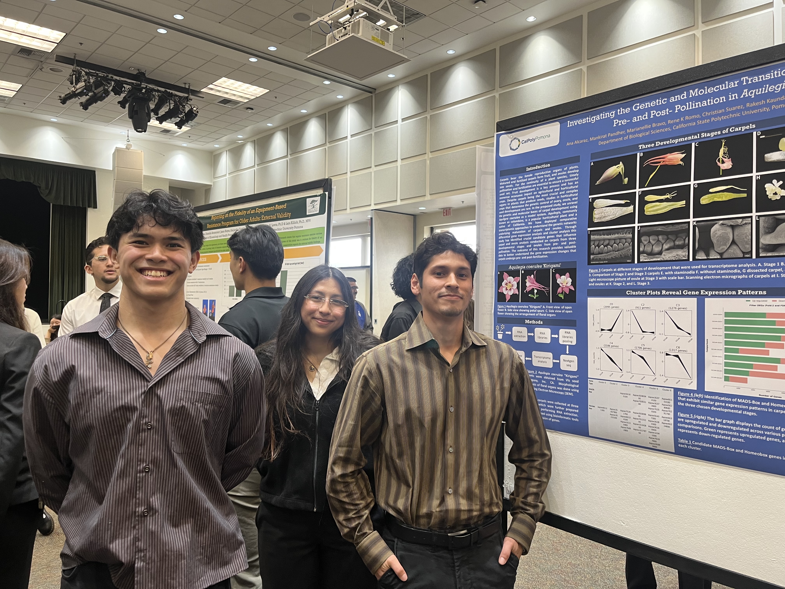

## Degrees

### M.S. Biological Sciences. California State Polytechnic University, Pomona

##### 2024 to present

Thesis: A Study to Identify Candidate Genes Within the Homoebox Family that Play a Role in Carpel Development in Aquilegia Advisor: Dr. Bharti Sharma

### B.S. Biology, California State Polytechnic University, Pomona

##### 2019 to 2024

• Dean’s List: 2019, 2022. 2023

## Publications

1.  **"**[Comparative case study of evolutionary insights and floral complexity in key early-diverging eudicot Ranunculales models](https://www.frontiersin.org/journals/plant-science/articles/10.3389/fpls.2024.1486301/full)**"** – \[Frontiers in Plant Science, 2024\]
2.  "[*Delphinium* as a model for development and evolution of complex zygomorphic flowers](https://www.frontiersin.org/journals/plant-science/articles/10.3389/fpls.2024.1453951/full)" - \[Frontiers in Plant Science, 2024\]

::: {style="text-align: center;"}
{.soft-pink-img width=500}
:::

## Conferences & Symposiums

-   (Poster) Marianellie Bravo, Rene K. Romo, Ana Alcaraz Echeveste, and Christian Suarez “Pre- and Post-Fertilization Molecular Dynamics in *Aquilegia* Carpel Development​” **Agriculture Research Institute 2025 Showcase** – California Polytechnic State University – Pomona (April 2025)

-   (Oral) Marianellie Bravo "Identifying Conserved Genes in Pre- and Post-Pollinated Carpels in *Aquilegia*" A**griculture Research Institute Fellowship, Workshop 4** - California Polytechnic State University – Pomona (April 2025)

-   (Poster) Marianellie Bravo, Rene K. Romo, Ana Alcaraz Echeveste, and Christian Suarez “A Study to Identify Homeobox Genes in Pre- and Post-Pollinated Carpels in *Aquilegia*” **13th Annual Cal Poly Pomona Student Research Conference (RSCA)** – California Polytechnic State University – Pomona (Mar 2025)

-   (Oral) Marianellie Bravo “Using Differential Gene Expression to Highlight Genes Responsible for Carpel Development and Seed Formation in *Aquilegia*” **Ronald E. McNair Scholars Undergraduate Research Symposium** – California Polytechnic State University – Pomona (May 2024)

-   (Oral) Marianellie Bravo “A Study to Identify Homeobox Genes in Pre- and Post-Pollinated Carpels in *Aquilegia*” **12th Annual Cal Poly Pomona Student Research Conference (RSCA)** – California Polytechnic State University – Pomona (Mar 2024)

-   (Poster) Rene K. Romo, Mankirat K. Pandher, and Marianellie Bravo “A Study to Identify MADS-box Genes in Pre- and Post-Pollinated Carpels in *Aquilegia*” **12th Annual Cal Poly Pomona Student Research Conference (RSCA)** – California Polytechnic State University – Pomona (Mar 2024)
