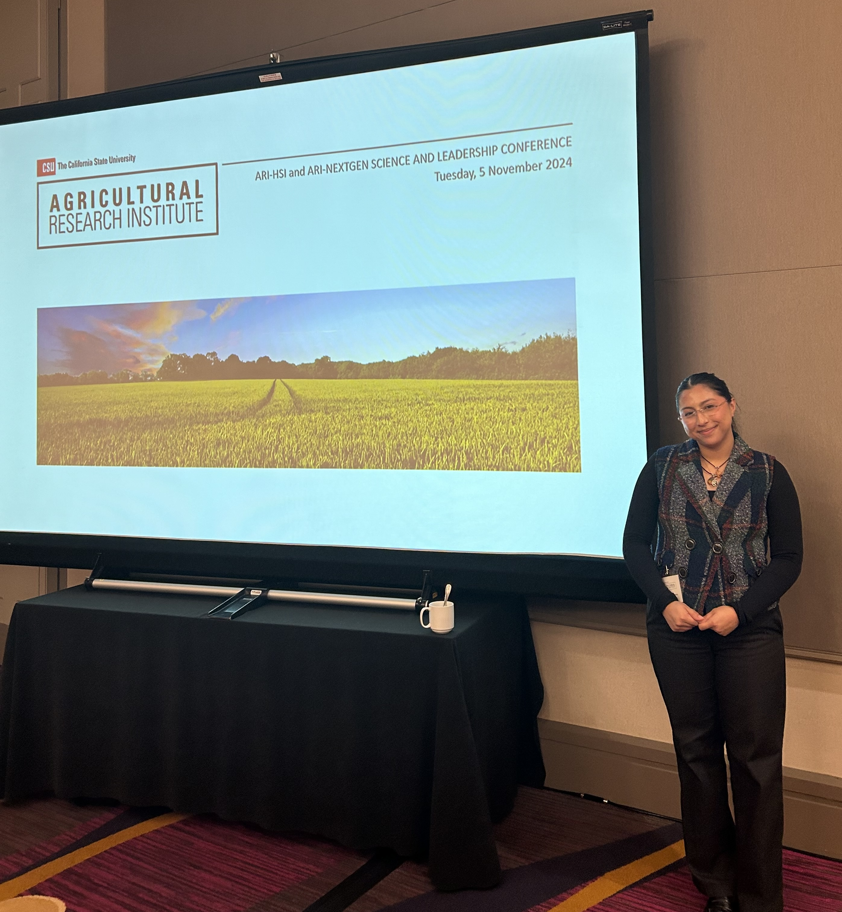
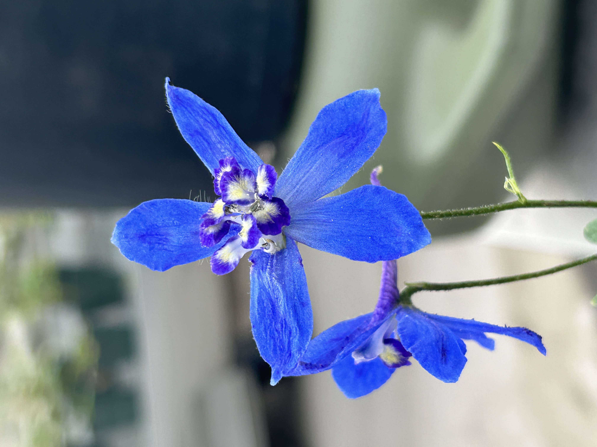
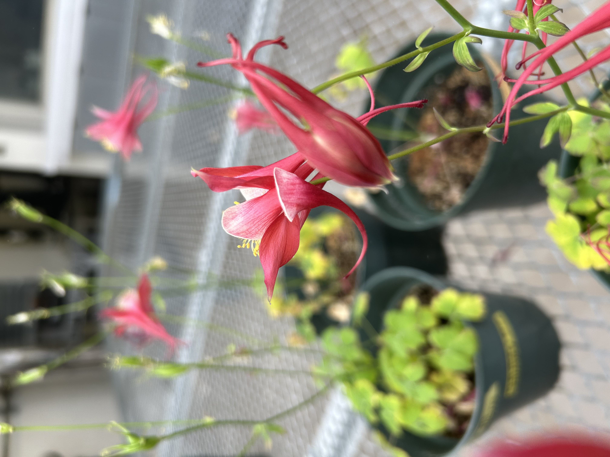
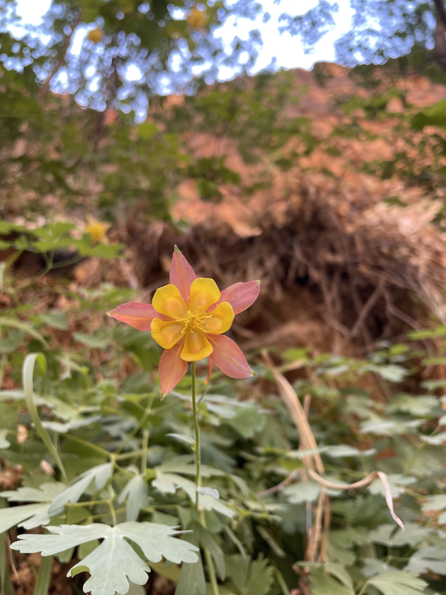

::: {style="text-align: center;"}
## Contact Info

📧 marianellieb\@cpp.edu 📧 marianellieb\@gmail.com 💻 [GitHub](https://github.com/marianellieb) 🌐 [LinkedIn](https://www.linkedin.com/in/marianellie-bravo-7a0681260/)

## Traditional CV

[📄 Download my CV (PDF)](Bravo_Marianellie_CV.docx)
:::

------------------------------------------------------------------------

## About Me

::::: columns
::: {.column width="60%"}
Hi! I’m Marianellie Bravo — a dedicated educator and researcher with a background in biological sciences and a passion for making science accessible and engaging.

Experienced teaching assistant committed to fostering inclusive learning environments, supporting student success, and collaborating on innovative curriculum. Skilled in data analysis and visualization, bringing a unique perspective to STEM instruction.
:::

::: {.column width="40%"}
{.fancy-img width="100%"}
:::
:::::

## Current Step of My Journey

I am a graduate student in the Biological Sciences Department at Cal Poly Pomona. I am in the Sharma lab and we study Aquilegia and Delphinium (pictured below). We utilize transcriptomics to determine the genes that play crucial roles in seed formation in early-diverging eudicots.

------------------------------------------------------------------------

## Photos by Me!

  
  Mutated Delphinium

  
  Aquilegia Coerulea at the CPP greenhouse

  
  In the Wild, Utah, CA

